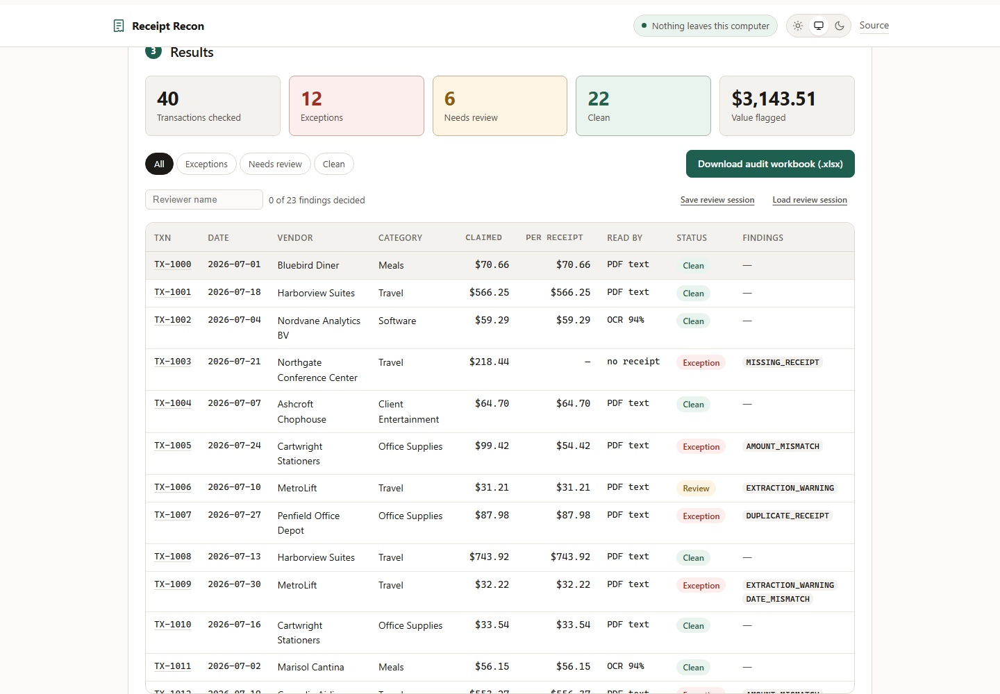

# Receipt Recon

**Audit an expense report against its receipt PDFs. In your browser. Nothing gets uploaded.**

You drop in a spreadsheet and a folder of receipts. Every row gets matched to its
support document, checked against policy, and you get an Excel workbook saying what
is wrong, why, and which receipt proves it.

**[Try it now →](https://receipt-recon.com/)** · no install, no signup, no API key



---

## Why this exists

Someone on Reddit asked for a cheaper alternative to [Shortcut](https://shortcut.ai)
for auditing monthly expense reports of up to 350 transactions, each with its own
PDF receipt. Their boss suggested Copilot. They were right that Copilot won't do it.

The useful thing we found while building this:

> **At 350 receipts a month, every option costs $0. Cost is not what should decide this.**

Gemini's free tier, Mistral's free tier, local OCR, a paid API at that volume, all
land at or near nothing. So the real questions are the other three:

1. **Is your data safe?** Google's free Gemini tier states plainly that submitted
   content is used to improve their products and that human reviewers may see it.
   Mistral's free tier trains on your data too, unless someone remembers to flip an
   opt-out. Expense receipts carry employee names, card digits and client financials.
2. **Can a non-developer actually run it?** Most answers to this problem are a Python
   pipeline. On a locked-down corporate laptop, `pip install` is where they die.
3. **Is the answer reproducible?** An auditor has to re-run last month and get last
   month's answer, and explain to a partner exactly why a row was flagged. A model
   that summarises "looks fine" cannot do either.

This tool is the answer that survives all three.

## The part nobody says out loud

**Auditing expenses is mostly not an AI problem.** Once you have the fields off a
receipt, roughly 85% of a real audit is arithmetic and table lookups: does the amount
match, is the receipt there, is this the same receipt twice, does this group of
charges add up to just under an approval limit.

So the AI budget goes on exactly one job, reading the PDF, and the checking is plain
deterministic code. Same inputs, same output, every single time.

On the bundled sample set:

| Tier | How it reads the receipt | Hit rate | Speed |
| --- | --- | --- | --- |
| 1 | PDF text layer (pdf.js) | **33 / 37** | ~5 ms |
| 2 | WASM OCR (tesseract.js) | **4 / 37** | ~460 ms |
| 3 | Gives up and says so | 0 / 37 | — |

Tier 3 is a feature. A tool that guesses when it cannot read a document is worse
than one that says "check this one yourself".

## Your files never leave your computer

This is not a promise in a README, it is enforced three ways:

- **There is no server.** The page is static files. There is no backend to receive
  anything, no account, no API key.
- **The browser blocks it.** A Content Security Policy sets `connect-src 'self'`, so
  the page is physically unable to open a connection to another host. Not "won't",
  *can't*. Try it: open DevTools → Network, run the whole audit, and watch nothing
  go out.
- **The page watches itself.** A wrapper around `fetch` and `XMLHttpRequest` flips the
  badge in the corner to a red warning if anything ever tries to call out.

Disconnect from the network entirely and it still works.

## What it checks

Every rule is deterministic and every threshold is editable in the UI.

**Documentation**
- `MISSING_RECEIPT` — no support document, at or above the $75 IRS documentary-evidence floor
- `NO_RECEIPT_UNDER_FLOOR` — under $75, so a receipt is not required; flags only if amount, date, place or purpose is missing
- `CATEGORY_EXEMPT_NO_RECEIPT` — mileage and per-diem have no receipt by nature, so they are not asked for one at any amount; still flagged if date, place or purpose is missing. The exempt list is editable and is printed into the workbook, so the suppression is disclosed rather than silent
- `UNREADABLE_RECEIPT` — the file is there but could not be read; never guessed at
- `MISSING_ITEMIZATION` — a meal over the threshold with no itemised detail

**Matching the row against the receipt**
- `AMOUNT_MISMATCH` — claimed amount differs from the receipt total
- `UNSUPPORTED_TIP` — claimed exceeds the printed total within a plausible tip band, reported as a soft signal rather than a hard mismatch, so the queue doesn't flood
- `DATE_MISMATCH` · `VENDOR_MISMATCH` · `CURRENCY_MISMATCH`
- `CURRENCY_UNVERIFIED` — no currency could be read off the receipt, so the amount check compared two bare numbers and could not confirm they were the same unit. Soft, because it is an unverified assumption rather than a proven violation
- `RECEIPT_DOES_NOT_FOOT` — subtotal + tax + tip does not equal the printed total, so a number was misread or altered

**Policy**
- `OVER_CATEGORY_LIMIT` · `POLICY_ALCOHOL` · `PERSONAL_EXPENSE`

**Budget reconciliation**, when the workbook carries a budget or cover sheet
- `BUDGET_EXCEEDED` — a category's spend crossed its budget line, compared strictly within that line's own currency
- `BUDGET_CURRENCY_UNMATCHED` — spend in a currency the budget has no line for; reported for a human, never converted with a guessed FX rate
- `BUDGET_CURRENCY_AMBIGUOUS` — a budget line with no stated currency over spend in several currencies; unverifiable, and says so
- `BUDGET_UNBUDGETED_SPEND` — spend in a category the budget never mentions

**Card-statement reconciliation**, when you drop in the month's card export (optional, local file only — no bank connection)
- `UNCLAIMED_CHARGE` — a statement charge with no matching expense row at all: spend that was never reported. This used to be the tool's biggest declared blind spot
- `CLAIMED_NOT_ON_STATEMENT` — an expense row with no charge behind it. Soft, because cash or a personal card is an innocent explanation
- Matching is one-to-one, within a named date tolerance (default 5 days, editable) and the amount tolerance; amounts are compared as absolute values because card exports disagree on sign, and payment lines are skipped and disclosed

**Patterns across the whole batch** (invisible to any per-row check)
- `DUPLICATE_RECEIPT` — the same PDF cited by two rows; both get flagged, because the tool cannot know which is the original
- `DUPLICATE_CHARGE` — same vendor, date and amount claimed twice under different receipts
- `SPLIT_TRANSACTION` — several charges by one person at one vendor in a short window that total over the approval threshold while no single one crosses it

**Soft signals** kept in their own tier, so they never bury a real violation
- `WEEKEND_CHARGE` · `ROUND_AMOUNT` · `STALE_SUBMISSION` · `EXTRACTION_WARNING`

## What you get

An `.xlsx` with four tabs, plus one each when a budget or a card statement was reconciled:

| Tab | What's in it |
| --- | --- |
| **Summary** | Counts, value flagged per currency, findings by rule, a per-employee breakdown sorted by flagged value, and a SHA-256 run hash |
| **Audit Detail** | Every transaction, not just the problems, with how each receipt was read and at what confidence |
| **Exceptions** | One row per finding, with the triggering value, the threshold, and the **reviewer decision / reviewer / date / note** columns — pre-filled with the decisions you made in the evidence drawer, blank where the item is still open |
| **Budget Recon** | Each budget line against actual spend in its own currency, with the overruns and everything that could not be verified. If you typed FX rates into the policy panel, a clearly labelled "at your stated rates" estimate is appended — findings never use it |
| **Statement Recon** | The matching rule with its tolerances, every unclaimed charge, and the rows with no charge behind them |
| **Methodology** | The ruleset version, every threshold applied, and an explicit list of what was *not* verified |

The run hash is the reproducibility proof: same report, same receipts, same policy,
same hash, same findings. That is the thing an LLM cannot give you.

## Prove it works before you trust it

Click **Try it with sample data**. You get 40 transactions with **15 problems planted
on purpose**, and [`sample-data/EXPECTED-FINDINGS.md`](sample-data/EXPECTED-FINDINGS.md)
is the answer key listing every one.

Check the tool against the key. Four of the receipts are image-only PDFs with no text
layer at all, so you can watch the OCR tier work.

Regenerate the set at any size:

```bash
python tools/make_sample_data.py --count 350
```

## Using it on real data

1. Open the [live page](https://receipt-recon.com/), or download this
   repo and open `index.html` through any local server.
2. Drop in your expense report. Column headers are matched loosely, so `Amount`,
   `Total`, `Claimed` and `Gross` all work. A multi-sheet workbook is fine: the
   sheet holding the transactions is found automatically, and if the workbook has
   a budget or cover sheet (a table with a category column and a budget column,
   in one currency or several), it is picked up and reconciled against the
   report. Both guesses are shown as dropdowns you can override — and **Columns
   we found** shows exactly which column feeds each field, with a dropdown per
   field to correct a wrong guess. Corrections are remembered on this computer
   for files with the same header row, so a monthly export is fixed once.
3. Drop in the receipts folder. PDFs and phone photos (`.jpg`, `.jpeg`, `.png`,
   `.webp`) both work; photos are read by the OCR tier. Files are matched by the
   receipt-file column, falling back to matching on the transaction ID. Anything
   that is not a receipt is reported ignored, by name.
4. Optionally drop in the month's **card statement** export (`.xlsx` or `.csv`,
   downloaded by you — the tool never connects to a bank). Charges that were
   never expensed and expense rows with no charge behind them both surface.
5. Adjust **Policy settings** to your own thresholds and word lists — category
   limits, alcohol and personal-expense keywords, receipt-exempt categories, all
   of it. Your policy is remembered in this browser (never uploaded), so an
   in-house policy is taught once. **Save policy file** writes it to a plain
   JSON file you can keep in version control or hand to a colleague; **Load
   policy file** applies one, after checking every value's type. You can also
   type month-end FX rates: they feed only a clearly labelled "at your stated
   rates" estimate under the budget card — no finding ever converts a currency.
6. **Run the audit.** Review each finding in the evidence drawer: Approve,
   Reject or Needs-follow-up, with a note. Decisions land in the workbook's
   Exceptions tab, and **Save review session** keeps them as a file you can
   reload later — they are deliberately not stored in the browser.
7. Download the workbook.

Roughly a minute for 350 transactions when most have a text layer, longer if many
need OCR.

## Keyboard, screen readers, and contrast

The whole task works without a mouse. Tab reaches both file pickers, the
transaction id in each row is a real button that opens the evidence drawer on
Enter, and Escape closes the drawer and puts focus back on the row you came
from. On a multi-page receipt the drawer gets Previous and Next controls, so a
total that sits on page 2 of a hotel folio is reachable by keyboard rather than
invisible. Progress is announced at milestones instead of on every row, so a
350-row run does not read out 350 updates.

Every finding states its severity in words next to the colour, so the exception
tiers survive colour blindness and a black-and-white print of the workbook. Text
meets WCAG 2.2 AA in both the light and dark themes, checked against the rendered
page rather than the palette. Theme follows your system and can be pinned to
light or dark from the top bar.

## Honest limits

Read these before relying on it.

- **The card statement is compared only if you supply it, and only that file.**
  There is no bank connection, on purpose. Skip the statement drop and a charge
  that exists with no expense row stays invisible, exactly as before.
- **FX rates are yours, not the market's.** The "at your stated rates" view uses
  numbers you typed; a hand-typed month-end rate rarely reconciles to the penny
  against the card's actual conversion. That is why it is an estimate view and
  never a finding.
- **OCR quality on genuinely bad receipts is the weak point.** Tesseract handles clean
  scans well (94% confidence on the sample set) and struggles with crumpled, angled
  phone photos. Low-confidence reads are flagged, never silently accepted.
- **Business purpose is not judged.** Whether a stated reason is genuine is a human call.
- **Mileage and per-diem rows cannot be verified.** They have no receipt by nature.
- **Vendor matching is a similarity score**, not an identity check. The score and
  threshold are printed on every finding so you can second-guess it.
- **It drafts an audit, it does not sign one.** Nothing is auto-cleared.

## Development

```bash
npm install          # dev-only; the app itself has zero runtime dependencies
npm run sample       # regenerate the sample data (needs Python + reportlab, openpyxl, pypdfium2)
npm test             # 87 unit and integration tests
npm run serve        # http://localhost:8080
node tools/browser-check.mjs   # drives the real page in a real browser
node tools/a11y-check.mjs      # keyboard, focus, contrast, sorting, theming
```

The two browser checks are the ones that matter, and they answer different
questions. `browser-check.mjs` asks whether the audit is **correct**: it runs the
full audit in Chromium, asserts the findings against the answer key, exercises
the OCR tier, downloads the workbook, and **fails if the page makes a single
external network request**. It also corrupts one PDF in a copy of the sample
folder and asserts the run still renders all 40 rows with exactly one
`UNREADABLE_RECEIPT`, because one bad file must cost one row and not the run.

`a11y-check.mjs` asks whether the audit is **usable**, with each assertion
mapped to a defect that shipped in an earlier version: both file pickers
reachable by Tab, focus moving into the evidence drawer and back out to
the row that opened it, the table header actually sticking, sort order including
the blanks-last rule, theme persistence across a reload, severity stated in
words rather than colour alone, the evidence drawer paging through a multi-page
receipt by keyboard, re-picking the receipts folder replacing the previous set
instead of merging with it, reviewer decisions operable by keyboard alone with
their pressed state exposed, every column-mapping select bound to a label, and
**every rendered text node measured against WCAG AA in both themes**. The contrast check is measured on the painted page, not
calculated from the tokens, so inherited colours and tinted parents cannot hide a
failure.

Both browser checks build their own fixtures where the sample set cannot cover a
case: a two-page PDF for the drawer paging check, and a deliberately corrupt one
for fault isolation.

Everything in `vendor/` is committed on purpose. There is no build step and no CDN,
because a tool that stops working when a CDN is blocked is no use on a corporate
network.

## Built on

[pdf.js](https://mozilla.github.io/pdf.js/) · [tesseract.js](https://tesseract.projectnaptha.com/) ·
[SheetJS](https://sheetjs.com/) — all permissively licensed, all running locally.

PyMuPDF is deliberately *not* used anywhere, including the sample-data generator:
it is AGPL-3.0, which would conflict with publishing this under MIT.

## License

MIT. Use it, fork it, put it on your company's intranet, take it to your boss instead
of the $49/month invoice.
